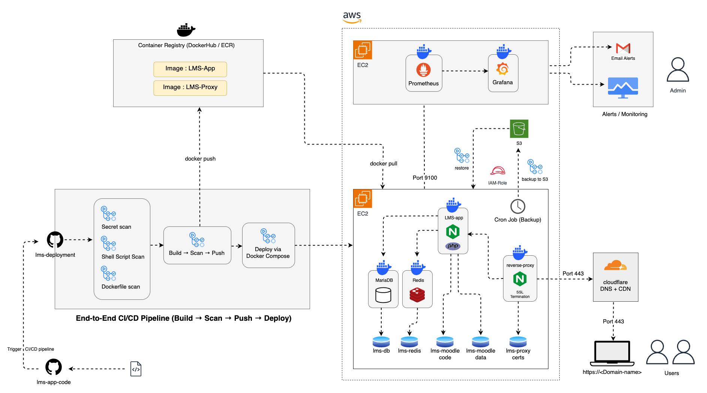
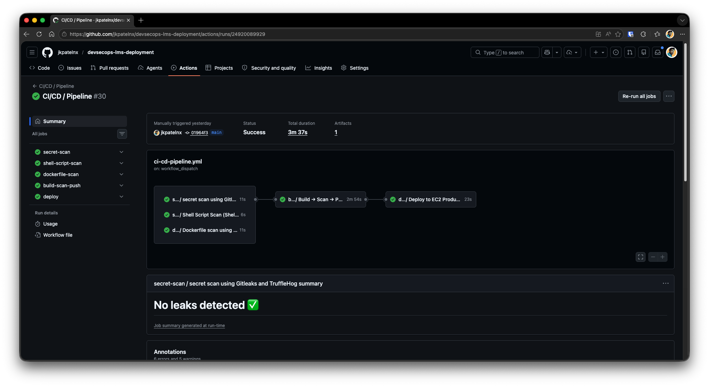
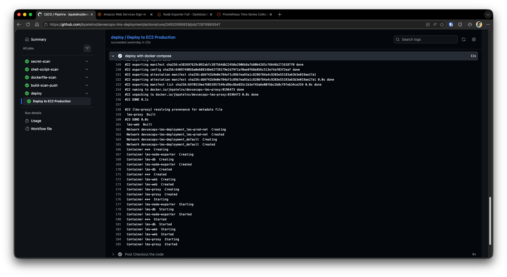
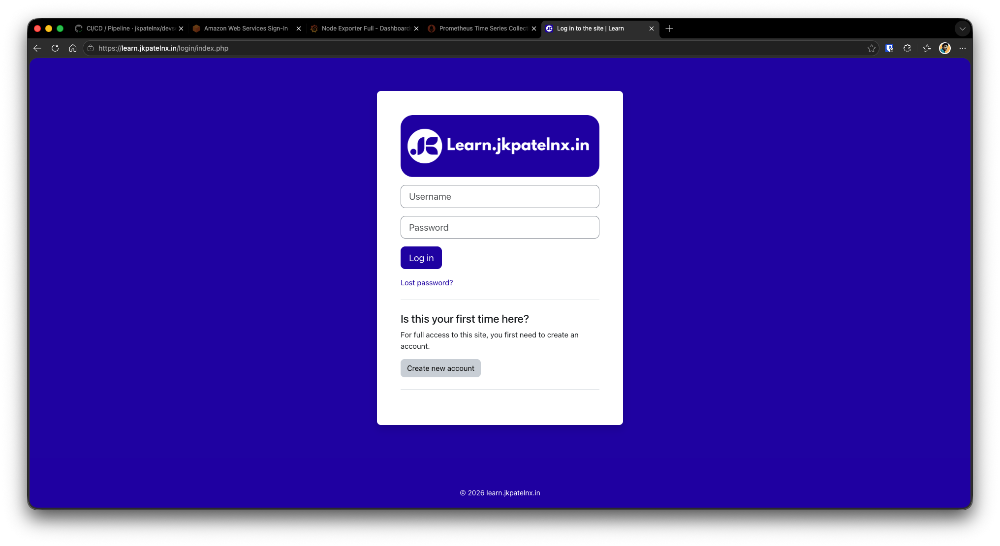
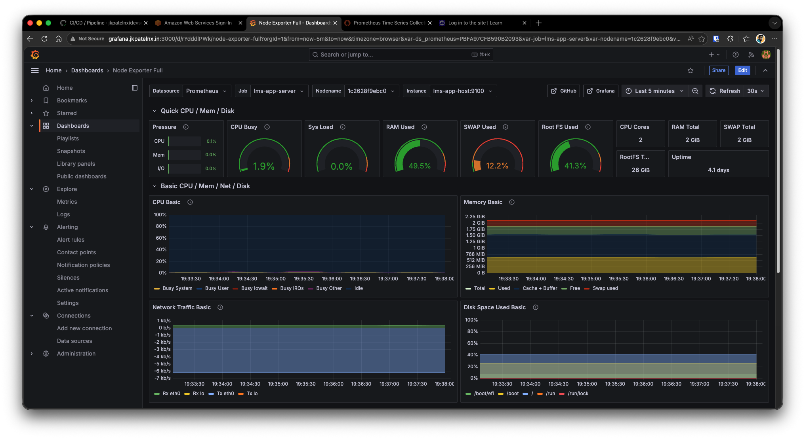
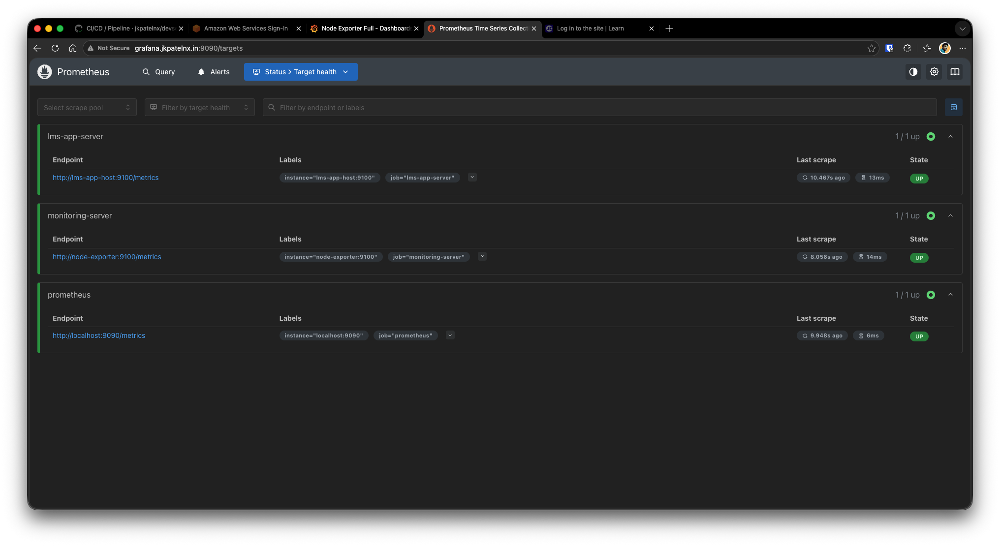
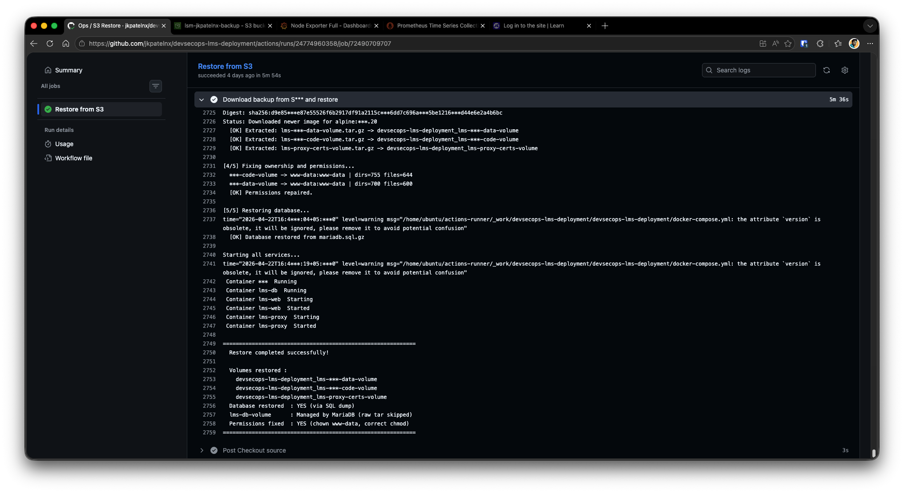
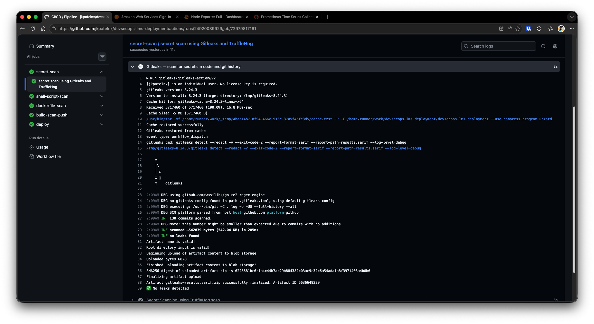
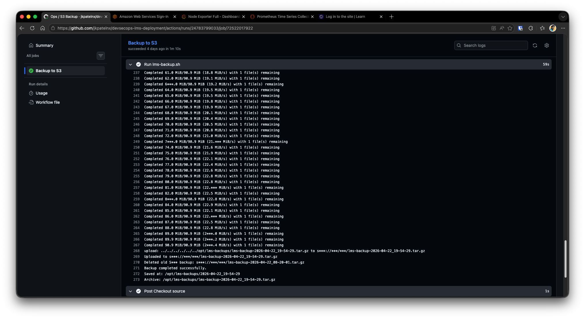
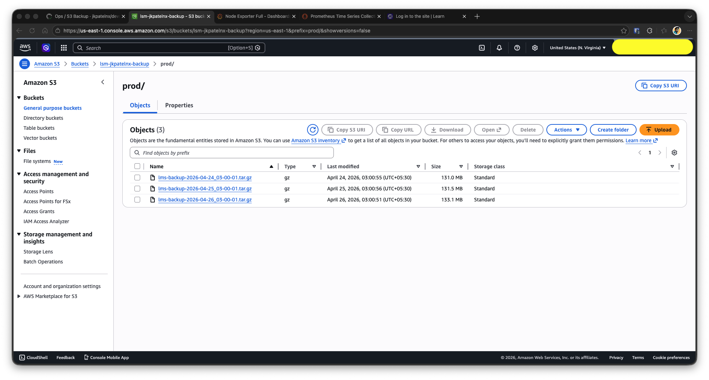

<h1 align="center">DevSecOps LMS Deployment</h1>

<p align="center">
  
  
  
  
</p>

<p align="center">
  Containerized Moodle LMS deployment on AWS with CI/CD, security scans, observability, and backup/restore automation.
</p>

<p align="center">
  <a href="https://learn.jkpatelnx.in"><strong>Live Demo</strong></a>
</p>

## Why This Project

This repository demonstrates practical DevSecOps skills by building and operating a full LMS stack, not just running an app locally.

It focuses on:

- Infrastructure-as-code style deployment with Docker Compose
- Security checks in CI before deployment
- Runtime monitoring and alerting
- Disaster recovery with backup and restore workflows

## Architecture

<p align="center">
  
</p>

Diagram source: `docs/diagrams/architecture.drawio`

### Request Flow

1. Client request reaches Cloudflare DNS/proxy.
2. Traffic is forwarded to Nginx reverse proxy container.
3. Nginx forwards app traffic to the Moodle web container.
4. Moodle uses MariaDB (primary data) and Redis (session/cache).

### Operations Flow

1. GitHub Actions runs security checks and image build pipeline.
2. Images are pushed to Docker Hub.
3. Self-hosted runner on EC2 deploys updated containers with Docker Compose.
4. Monitoring stack (Prometheus + Grafana) tracks host and service metrics.

### Backup and Recovery Flow

1. Scheduled backup script creates DB dump + volume archives.
2. Backup artifact is uploaded to S3 (if bucket configured).
3. Restore script can rebuild volumes and database from a chosen backup.

## Repository Structure

```text
.
├── app/                    # Moodle web image and runtime bootstrap
├── proxy/                  # Nginx TLS reverse proxy image
├── monitoring/             # Prometheus + Grafana stack
├── scripts/                # Setup, backup, restore, and host bootstrap scripts
├── .github/workflows/      # CI/CD and ops workflows
├── docker-compose.yml      # Main LMS stack (app, db, redis, proxy, exporter)
└── README.md
```

## Stack Components

- Cloud platform: AWS EC2, Amazon S3
- Containers: Docker, Docker Compose
- Application: Moodle (PHP-FPM + Nginx)
- Data: MariaDB
- Cache/session: Redis
- Observability: Prometheus, Grafana, Node Exporter
- CI/CD: GitHub Actions + self-hosted runner
- Edge/DNS: Cloudflare

## CI/CD Pipeline

Current pipeline flow:

1. Secret scan
2. Shell script scan
3. Dockerfile scan
4. Build app and proxy images
5. Trivy vulnerability scan (high/critical fail)
6. Push images to Docker Hub
7. Deploy on EC2 through self-hosted runner

Pipeline trigger modes currently enabled:

- Manual trigger (`workflow_dispatch`)
- External event trigger (`repository_dispatch`)

### Cross-Repository Auto Trigger

Deployment is automatically triggered when application code is pushed to:

- `jkpatelnx/devsecops-lms-app` (branch: `main`)

How it works:

1. A workflow in `jkpatelnx/devsecops-lms-app` runs on push to `main` (excluding docs/license-only changes).
2. That workflow calls GitHub API `repos/jkpatelnx/devsecops-lms-deployment/dispatches`.
3. It sends event type `lms-app-updated`.
4. This repository receives the `repository_dispatch` event and runs the CI/CD pipeline.

This means deployment is auto-triggered by app code pushes, while still allowing manual trigger from this repository.

## Implementation Validation

Primary validation results are shown below. Additional screenshots are included in an expandable section to keep this README concise.

### CI/CD Validation

**Pipeline success (scan -> build/scan/push -> deploy)**



**Deployment results on EC2 self-hosted runner**



### Live Application Validation

**Live Moodle login page served over HTTPS**



### Observability Validation

**Grafana dashboard with real-time node metrics**



**Prometheus target health (all core targets UP)**



### Backup and Restore Validation

**Disaster recovery restore success (volumes + DB + service restart)**



<details>
<summary><strong>Additional Validation Results</strong></summary>

<br />

**Secret scanning results (Gitleaks + TruffleHog, zero leaks)**



**Backup workflow success with S3 upload confirmation**



**S3 object listing for retained backup files**



</details>

## Security Controls

Implemented controls:

- Secrets scanning in CI
- Shell script scanning in CI
- Docker image CVE scanning using Trivy
- Isolated bridge network for service communication
- TLS termination at reverse proxy
- IAM role based S3 access pattern for backup upload

## Observability

Monitoring stack provides:

- Prometheus metrics collection
- Grafana dashboards (provisioned from files)
- Grafana contact point for email alert notifications
- Node-level host monitoring through Node Exporter

## Backup and Restore

Backup script covers:

- MariaDB SQL dump
- Moodle code/data Docker volumes
- Proxy cert volume
- Compose file and optional env backup
- Optional S3 offload with retention cleanup

Restore script covers:

- Volume restoration
- Permission repair for Moodle directories
- Database restoration from SQL dump
- Service bring-up after restore

## Quick Start (Local or EC2)

### 1) Prerequisites

- Linux host (Ubuntu recommended)
- Docker and Docker Compose installed
- AWS CLI installed if S3 backup upload is needed

### 2) Configure Environment

Copy and edit environment file:

```bash
cp .env-example .env
```

Set required values in `.env` (DB credentials, domain, redis password, etc.).

### 3) Start LMS Stack

```bash
docker compose up -d --build
```

### 4) Start Monitoring Stack

```bash
cd monitoring
cp .env-example .env
docker compose up -d
```

## Verification Checklist

Use this list before sharing the project in interviews:

- LMS UI is reachable over HTTPS
- Grafana dashboard loads and metrics are visible
- CI workflow runs green for scan + build stages
- A backup archive is generated and visible locally
- S3 upload works (if configured)
- Restore test has been executed at least once

## Known Limitations

- Current deployment uses container recreation, which can introduce short service interruption during release.
- CI/CD is currently driven by `repository_dispatch` and `workflow_dispatch`; direct PR/push gating is not enabled by default.
- Proxy TLS falls back to self-signed certificates unless externally managed certificates are configured.
- Secrets handling is environment-variable based and can be further strengthened with a centralized secret manager.

## License

This project is licensed under the MIT License. See `LICENSE`.
